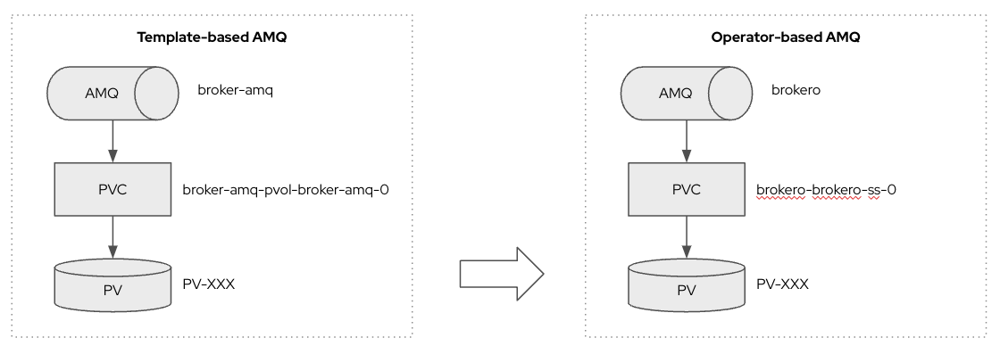

## Migrate data from Template-based to Operator-based AMQ on OpenShift

### Prerequisites
OpenShift 4.9 up and running AMQ broker installed based on template



### How to

1. Scale AMQ StatefulSet to `0`

2. Set persistentVolumeReclaimPolicy: Retain for Persistent Volume: PV-XXX

3. Delete PVC broker-amq-pvol-broker-amq-0

4. When Persistent Volume: PV-XXX released
   ```
   status:
   phase: Released
   ```
   delete claimRef field from Persistent Volume: PV-XXX

5. Create PVC brokero-brokero-ss-0 using same PV spec, ex:
   ```
   kind: PersistentVolumeClaim
   apiVersion: v1
   metadata:
   name: brokero-brokero-ss-0
   finalizers:
      - kubernetes.io/pvc-protection
   labels:
      ActiveMQArtemis: brokero
      application: brokero-app
   spec:
   accessModes:
      - ReadWriteOnce
   resources:
      requests:
         storage: 1Gi
   storageClassName: gp2
   volumeMode: Filesystem
   volumeName: PV-XXX
   ```

6. Create Operator-based AMQ Broker with name: brokero, ex:
   ```
   kind: ActiveMQArtemis
   apiVersion: broker.amq.io/v1beta1
   metadata:
   name: brokero
   application: brokero
   spec:
   acceptors:
      - port: 61616
         expose: true
         name: all
         protocols: all
         anycastPrefix: jms.queue.
         verifyHost: false
         sslEnabled: false
   adminPassword: admin
   deploymentPlan:
      size: 1
      persistenceEnabled: true
      requireLogin: false
      messageMigration: false
      managementRBACEnabled: true
      journalType: nio
      jolokiaAgentEnabled: false
      image: placeholder
   console:
      expose: true
   adminUser: admin
   ```

